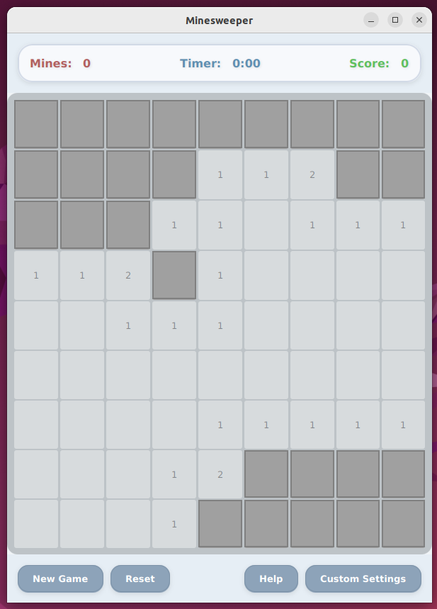

# Minesweeper Game

**Name**: Clarisse CARVALHO

**Subject**: PIS

## Project Overview

Logic Minesweeper is a new twist on the classic Minesweeper game. Instead of showing number for adjacent mines, the board provides logical clues. Players must deduce bomb positions using reasoning rather than counting. 

The game starts with at least three initial rules (depending on the level), ensuring that the puzzle is solvable from the beginning. Each revealed cell provides a clue, which gradually eliminates possibilities until all bombs are found.

Types of clues: row/column totals, directional hints, or conditional logic

The interactive version will be implemented using JavaFX.

## Features

- [✓] **Window & Layout**
  - [✓] Create main window
  - [✓] Add menu bar / control panel
  - [✓] Define layout using JavaFX panes 

- [ ] **UI Elements**
  - [ ] Buttons (New Game, Reset, Help, Custom Settings)
  - [ ] Labels (Mines counter, Timer, Score)
  - [ ] Input fields / options for custom settings

- [ ] **Grid System**
  - [ ] Implement cell class (state: covered, revealed, flagged, mined, clue)
  - [ ] Handle left-click (reveal cell -> show clue)
  - [ ] Handle right-click (flag cell)
  - [ ] Add different clue types instead of numbers:
	- [ ] Row/Column bomb counts
	- [ ] Directional arrows (→, ↑, etc.)
  	- [ ] Conditional logic (e.g., “Exactly 1 of these cells has a bomb”)
  	- [ ] Global clues (e.g., “There are 5 bombs in total”)
  - [ ] Guarantee at least 3 starting rules
  
- [ ] **Game Mechanics**
  - [✓] Randomly place mines
  - [ ] Generate logical clues dynamically instead of numbers
  - [ ] Detect Game Over
  - [ ] Detect Winning condition

- [✓] **Game Mechanics**
  - [✓] Randomly place mines
  - [ ] Generate logical clues dynamically instead of numbers
  - [ ] Detect Game Over
  - [ ] Detect Winning condition

- [ ] **Custom Settings**
  - [ ] Adjustable grid size (9x9, 16x16, 16x32)
  - [ ] Adjustable mine density (Easy, Medium, Hard)
  - [ ] Limited flags mode (ON/OFF)
  - [ ] Limited time mode (ON/OFF)
  - [ ] Show Bomb Count (ON/OFF)

- [ ] **Additional Features**
  - [ ] Hint button (reveal one clue)
  - [ ] Check button (validate flagged bombs)
  - [✓] Game Over and Winning messages

## Installation

**Prerequisites**
- Java Development Kit (JDK)
- JavaFX SDK
- Eclipse IDE
- (Optional) Scene Builder

**Project Setup (GIT)**
1. Open Eclipse and go to `File > Import...`.
2. Select `Git > Projects from Git` and click `Next`.
3. Choose `Clone URI` and click `Next`.
4. Enter the repository URI:  
   `https://github.com/MitsukiS16/PUIO_PIS.git`  
   then click `Next` and `Finish`.
   
**Project Setup (ZIP)**
1. Download and Extract the ZIP file
2. Open Eclipse and go to `File > Import...`.
3. Select `General > Existing Projects into Workspace` and click `Next`.
4. Click `Browse` and locate the folder where you extracted the ZIP.
5. Ensure the project apppears in the `Projects`, then click `Finish`

**Configuring JavaFX**
- Add the JavaFX `lib` folder to your project’s build path  
  (`Project > Properties > Java Build Path > Add External JARs`).
- Create a Run Configuration for the project (`Run > Run Configurations...`).  
  Set `Main.java` as the main class.
- In the VM arguments field, add:  
  `--add-modules=javafx.controls,javafx.fxml`

**Running the Project**
- After importing and configuring JavaFX, run the project directly from Eclipse.
- The main window of the Minesweeper game will launch automatically.

## Usage
- Left-click on a cell to reveal its clue
- Right-click to flag a suspected mine
- Use logic (from the clues) to deduce bomb positions
- Use control buttons to start a new game, reset, or access custom settings

## Architecture & Implementation
- **Front-end:** JavaFX GUI built with `Scene`, `Stage`, and layout panes
- **Game Logic:** Handles mine placement, cell states, flagging, scoring, and timer
- **Key Classes:**
  - `Main.java` – Entry point; initializes JavaFX application and loads the main scene
  - `Grid.java` – Manages the grid and generates the board
  - `Cell.java` – Represents individual cells (covered, revealed, flagged, mined)
  - `GameController.java` – Controls game flow, events, and user interactions
  - `.fxml` files – Define UI layout 

## Screenshots

## Future Work
- Limited clue variety in early versions
- Only single-player mode
- No save/load game functionality
The game always starts with three initial rules, ensuring that the puzzle is solvable from the beginning